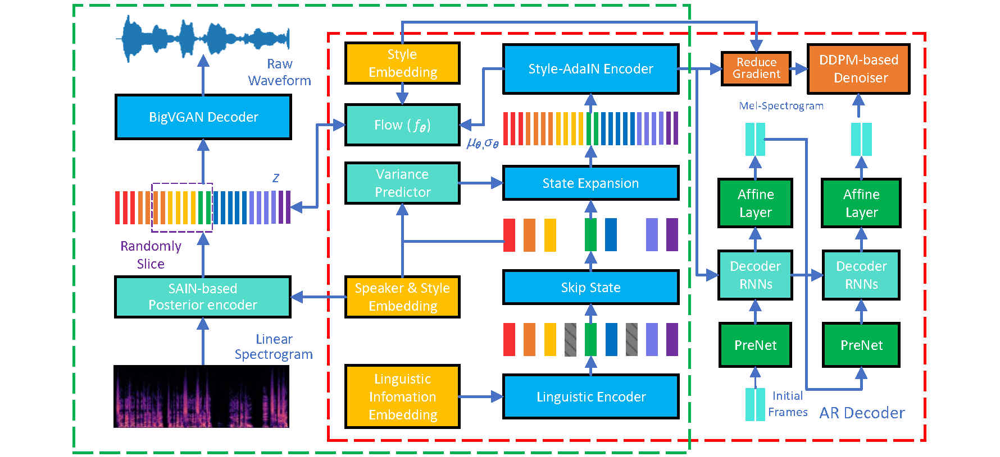

# 
 DurIAN-E 2: Duration Informed Attention Network with Adaptive Variational Autoencoder and Adversarial Learning for Expressive Text-to-Speech Synthesis

 
## Abstract

 This paper proposes an improved version of DurIAN-E (DurIAN-E 2), which is also a duration informed attention neural network for expressive and high-fidelity  text-to-speech (TTS) synthesis.  Similiar with the DurIAN-E model,
multiple stacked SwishRNN-based Transformer blocks are utilized as linguistic encoders and Style-Adaptive Instance Normalization (SAIN) layers are also exploited into frame-level encoders to improve the modeling ability of expressiveness in the proposed the DurIAN-E 2.
Meanwhile, motivated by other TTS models using generative models such as VITS,  the proposed DurIAN-E 2 utilizes variational autoencoders (VAEs) augmented with normalizing flows and a BigVGAN waveform generator with adversarial training strategy, which further improve the synthesized speech quality and expressiveness.  Both objective test and subjective evaluation results prove that the proposed expressive TTS model DurIAN-E 2 can achieve better performance than several state-of-the-art approaches besides  DurIAN-E. 
 

 

 

## Sound Samples

\* Note: All samples are in Mandrin Chinese.

 
## synthesized demos from different systems
 
 

<table align="center">
  <thead>
    <tr>
      <th>System</th>
      <th>Demo1</th>
      <th>Demo2</th>
    </tr>
  </thead>
  <tbody>
    
   <tr>
      <td>GT (vocoder) </td>
      <td><audio controls="" preload="auto">
            <source src="wavs/gt/test01.wav"></audio></td>
       <td><audio controls="" preload="auto">
            <source src="wavs/gt/test02.wav"></audio></td>
     
   </tr>
   <tr>
   <td>FastSpeech 2 </td>
    <td><audio controls="" preload="auto">
            <source src="wavs/fs/test01.wav"></audio></td>
    <td><audio controls="" preload="auto">
            <source src="wavs/fs/test02.wav"></audio></td>
    
   </tr>
   <tr>
    <td>DurIAN </td>
     <td><audio controls="" preload="auto">
            <source src="wavs/durian/test01.wav"></audio></td>
    <td><audio controls="" preload="auto">
            <source src="wavs/durian/test02.wav"></audio></td>
   </tr>
   <tr>
    <td>DiffSpeech </td>
     <td><audio controls="" preload="auto">
            <source src="wavs/ds/test01.wav"></audio></td>
    <td><audio controls="" preload="auto">
            <source src="wavs/ds/test02.wav"></audio></td>
   </tr>
   <tr>
    <td>DurIAN-E </td>
     <td><audio controls="" preload="auto">
            <source src="wavs/duriane/test01.wav"></audio></td>
    <td><audio controls="" preload="auto">
            <source src="wavs/duriane/test02.wav"></audio></td>
   </tr>
   <tr>
    <td>VITS</td>
     <td><audio controls="" preload="auto">
            <source src="wavs/vits/test01.wav"></audio></td>
    <td><audio controls="" preload="auto">
            <source src="wavs/vits/test02.wav"></audio></td>
   </tr>
    <tr>
    <td>DurIAN-E 2 </td>
     <td><audio controls="" preload="auto">
            <source src="wavs/duriane2/test01.wav"></audio></td>
    <td><audio controls="" preload="auto">
            <source src="wavs/duriane2/test02.wav"></audio></td>
   </tr>

  </tbody>
</table>
 
<table align="center">
  <thead>
    <tr>
      <th>System</th>
      <th>Demo3</th>
      <th>Demo4</th>
    </tr>
  </thead>
  <tbody>
    
   <tr>
      <td>GT (vocoder) </td>
      <td><audio controls="" preload="auto">
            <source src="wavs/gt/test03.wav"></audio></td>
       <td><audio controls="" preload="auto">
            <source src="wavs/gt/test04.wav"></audio></td>
     
   </tr>
   <tr>
   <td>FastSpeech 2 </td>
    <td><audio controls="" preload="auto">
            <source src="wavs/fs/test03.wav"></audio></td>
    <td><audio controls="" preload="auto">
            <source src="wavs/fs/test04.wav"></audio></td>
    
   </tr>
   <tr>
    <td>DurIAN </td>
     <td><audio controls="" preload="auto">
            <source src="wavs/durian/test03.wav"></audio></td>
    <td><audio controls="" preload="auto">
            <source src="wavs/durian/test04.wav"></audio></td>
   </tr>
   <tr>
    <td>DiffSpeech </td>
     <td><audio controls="" preload="auto">
            <source src="wavs/ds/test03.wav"></audio></td>
    <td><audio controls="" preload="auto">
            <source src="wavs/ds/test04.wav"></audio></td>
   </tr>
   <tr>
    <td>DurIAN-E </td>
     <td><audio controls="" preload="auto">
            <source src="wavs/duriane/test03.wav"></audio></td>
    <td><audio controls="" preload="auto">
            <source src="wavs/duriane/test04.wav"></audio></td>
   </tr>
   <tr>
    <td>VITS</td>
     <td><audio controls="" preload="auto">
            <source src="wavs/vits/test03.wav"></audio></td>
    <td><audio controls="" preload="auto">
            <source src="wavs/vits/test04.wav"></audio></td>
   </tr>
    <tr>
    <td>DurIAN-E 2 </td>
     <td><audio controls="" preload="auto">
            <source src="wavs/duriane2/test03.wav"></audio></td>
    <td><audio controls="" preload="auto">
            <source src="wavs/duriane2/test04.wav"></audio></td>
   </tr>
  </tbody>
</table>

 

<table align="center">
  <thead>
    <tr>
      <th>System</th>
      <th>Demo5</th>
      <th>Demo6</th>
    </tr>
  </thead>
  <tbody>
    
   <tr>
      <td>GT (vocoder) </td>
      <td><audio controls="" preload="auto">
            <source src="wavs/gt/test05.wav"></audio></td>
       <td><audio controls="" preload="auto">
            <source src="wavs/gt/test06.wav"></audio></td>
     
   </tr>
   <tr>
   <td>FastSpeech 2 </td>
    <td><audio controls="" preload="auto">
            <source src="wavs/fs/test05.wav"></audio></td>
    <td><audio controls="" preload="auto">
            <source src="wavs/fs/test06.wav"></audio></td>
    
   </tr>
   <tr>
    <td>DurIAN </td>
     <td><audio controls="" preload="auto">
            <source src="wavs/durian/test05.wav"></audio></td>
    <td><audio controls="" preload="auto">
            <source src="wavs/durian/test06.wav"></audio></td>
   </tr>
   <tr>
    <td>DiffSpeech </td>
     <td><audio controls="" preload="auto">
            <source src="wavs/ds/test05.wav"></audio></td>
    <td><audio controls="" preload="auto">
            <source src="wavs/ds/test06.wav"></audio></td>
   </tr>
   <tr>
    <td>DurIAN-E  </td>
     <td><audio controls="" preload="auto">
            <source src="wavs/duriane/test05.wav"></audio></td>
    <td><audio controls="" preload="auto">
            <source src="wavs/duriane/test06.wav"></audio></td>
   </tr>
   <tr>
    <td>VITS</td>
     <td><audio controls="" preload="auto">
            <source src="wavs/vits/test05.wav"></audio></td>
    <td><audio controls="" preload="auto">
            <source src="wavs/vits/test06.wav"></audio></td>
   </tr>
    <tr>
    <td>DurIAN-E 2 </td>
     <td><audio controls="" preload="auto">
            <source src="wavs/duriane2/test05.wav"></audio></td>
    <td><audio controls="" preload="auto">
            <source src="wavs/duriane2/test06.wav"></audio></td>
   </tr>
  </tbody>
</table>

 
<table align="center">
  <thead>
    <tr>
      <th>System</th>
      <th>Demo7</th>
      <th>Demo8</th>
    </tr>
  </thead>
  <tbody>
    
   <tr>
      <td>GT (vocoder) </td>
      <td><audio controls="" preload="auto">
            <source src="wavs/gt/test07.wav"></audio></td>
       <td><audio controls="" preload="auto">
            <source src="wavs/gt/test08.wav"></audio></td>
     
   </tr>
   <tr>
   <td>FastSpeech 2 </td>
    <td><audio controls="" preload="auto">
            <source src="wavs/fs/test07.wav"></audio></td>
    <td><audio controls="" preload="auto">
            <source src="wavs/fs/test08.wav"></audio></td>
    
   </tr>
   <tr>
    <td>DurIAN </td>
     <td><audio controls="" preload="auto">
            <source src="wavs/durian/test07.wav"></audio></td>
    <td><audio controls="" preload="auto">
            <source src="wavs/durian/test08.wav"></audio></td>
   </tr>
   <tr>
    <td>DiffSpeech </td>
     <td><audio controls="" preload="auto">
            <source src="wavs/ds/test07.wav"></audio></td>
    <td><audio controls="" preload="auto">
            <source src="wavs/ds/test08.wav"></audio></td>
   </tr>
   <tr>
    <td>DurIAN-E </td>
     <td><audio controls="" preload="auto">
            <source src="wavs/duriane/test07.wav"></audio></td>
    <td><audio controls="" preload="auto">
            <source src="wavs/duriane/test08.wav"></audio></td>
   </tr>
   <tr>
    <td>VITS</td>
     <td><audio controls="" preload="auto">
            <source src="wavs/vits/test07.wav"></audio></td>
    <td><audio controls="" preload="auto">
            <source src="wavs/vits/test08.wav"></audio></td>
   </tr>
    <tr>
    <td>DurIAN-E 2 </td>
     <td><audio controls="" preload="auto">
            <source src="wavs/duriane2/test07.wav"></audio></td>
    <td><audio controls="" preload="auto">
            <source src="wavs/duriane2/test08.wav"></audio></td>
   </tr>
  </tbody>
</table>

 
<table align="center">
  <thead>
    <tr>
      <th>System</th>
      <th>Demo9</th>
      <th>Demo10</th>
    </tr>
  </thead>
  <tbody>
    
   <tr>
      <td>GT (vocoder) </td>
      <td><audio controls="" preload="auto">
            <source src="wavs/gt/test09.wav"></audio></td>
       <td><audio controls="" preload="auto">
            <source src="wavs/gt/test10.wav"></audio></td>
     
   </tr>
   <tr>
   <td>FastSpeech 2 </td>
    <td><audio controls="" preload="auto">
            <source src="wavs/fs/test09.wav"></audio></td>
    <td><audio controls="" preload="auto">
            <source src="wavs/fs/test10.wav"></audio></td>
    
   </tr>
   <tr>
    <td>DurIAN </td>
     <td><audio controls="" preload="auto">
            <source src="wavs/durian/test09.wav"></audio></td>
    <td><audio controls="" preload="auto">
            <source src="wavs/durian/test10.wav"></audio></td>
   </tr>
   <tr>
    <td>DiffSpeech </td>
     <td><audio controls="" preload="auto">
            <source src="wavs/ds/test09.wav"></audio></td>
    <td><audio controls="" preload="auto">
            <source src="wavs/ds/test10.wav"></audio></td>
   </tr>
   <tr>
    <td>DurIAN-E </td>
     <td><audio controls="" preload="auto">
            <source src="wavs/duriane/test09.wav"></audio></td>
    <td><audio controls="" preload="auto">
            <source src="wavs/duriane/test10.wav"></audio></td>
   </tr>

   <tr>
    <td>VITS</td>
     <td><audio controls="" preload="auto">
            <source src="wavs/vits/test09.wav"></audio></td>
    <td><audio controls="" preload="auto">
            <source src="wavs/vits/test10.wav"></audio></td>
   </tr>
    <tr>
    <td>DurIAN-E 2 </td>
     <td><audio controls="" preload="auto">
            <source src="wavs/duriane2/test09.wav"></audio></td>
    <td><audio controls="" preload="auto">
            <source src="wavs/duriane2/test10.wav"></audio></td>
   </tr>
  </tbody>
</table>
